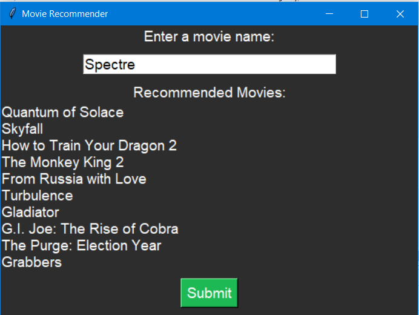

# 🎬 Movie Recommendation System 🎬

> 🦸‍♂️ **Find your next favorite movie with our simple movie recommendation system!**

## 📖 Table of Contents

- [Introduction](#-introduction)
- [Technologies Used](#-technologies-used)
- [Project Structure](#-project-structure)
- [Features](#-features)
- [Installation](#-installation)
- [Usage](#-usage)
- [Future Improvements](#-future-improvements)
- [Contributing](#-contributing)
- [License](#-license)

## 🧠 Introduction

The Movie Recommendation System is a Python-based application that helps users discover movies similar to their favorite ones. Utilizing natural language processing and machine learning techniques, it provides personalized movie recommendations through a user-friendly graphical interface.

# 🌟 Features

- Content-Based Filtering: Recommends movies based on the content of the movie (genres, keywords, cast, crew).
- Natural Language Processing: Processes movie overviews and tags using lemmatization.
- Cosine Similarity: Calculates similarity between movies using vector representations.
- Fuzzy Matching: Accepts approximate movie titles and finds the closest match.
- Graphical User Interface: Easy-to-use GUI built with Tkinter.
- Instant Recommendations: Get movie suggestions instantly upon entering a movie name or pressing Enter.

# 🚀 Technologies Used

- 🐍 Python
- 🎨 Tkinter for graphical user interface
- 🗂 Pandas for data manipulation
- 🧠 Scikit-learn for machine learning
- 🔢 NumPy for numerical operations
- 📚 NLTK for natural language processing
- 🔍 FuzzyWuzzy for fuzzy string matching

## 📂 Project Structure

- ─ main.py # Main application file
- ─ GUI.png # Screenshot of the GUI
- ─ README.md # Project README file

## 📊 Dataset

The movie datasets used in this project can be found at [TMDB Movie Metadata on Kaggle](https://www.kaggle.com/datasets/tmdb/tmdb-movie-metadata).

# 🔮 Future Improvements

- Improved Matching: Enhance the recommendation algorithm with more advanced NLP techniques.
- Additional Filters: Allow filtering by year, genre, or ratings.
- Web Application: Develop a web-based version using Flask or Django.
- Deployment: Deploy the application online for wider accessibility.

# 📄 License

This project is licensed under the MIT License - see the LICENSE file for details.

# Thank you for using the Movie Recommendation System! 🎥🍿
